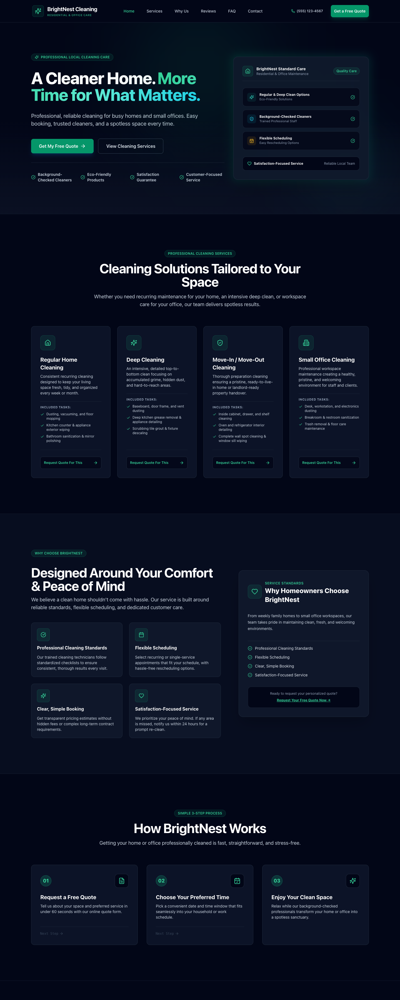
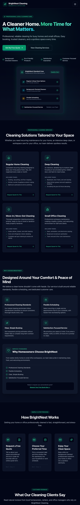
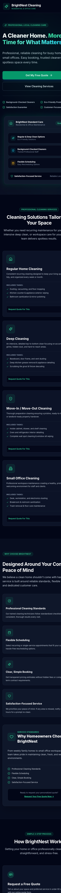

# BrightNest Cleaning — Responsive Service Business Website

A modern, conversion-focused, responsive business website built for a residential and small office cleaning service. Designed with a mobile-first responsive layout, accessible UI primitives, smooth section navigation, and an interactive quote request workflow.

> **Portfolio Disclaimer**: BrightNest Cleaning is a fictional portfolio demo created to demonstrate frontend web development, responsive UI implementation, and user experience design. The quote request form is frontend-only; no real customer data is collected, and no real requests are sent. In a live production environment, this form can be integrated with a CRM, email service, or booking management backend.

---

## Responsive Layout Previews

| Desktop View (1440px) | Tablet View (768px) | Mobile View (390px) |
| :--- | :--- | :--- |
|  |  |  |

---

## Key Features

* **Responsive Design**: Mobile-first architecture tested across 360px, 390px, 430px, 768px, 1024px, 1280px, and 1440px viewports without horizontal overflow.
* **Interactive Quote Form**: Real-time frontend validation, inline error messaging, submission state handling, demo success notifications, and a form reset action for continuous testing.
* **Service Selection Integration**: Clicking "Request Quote For This" on any service card automatically scrolls to the quote form and pre-selects the relevant service module in the select dropdown.
* **Accessible FAQ Accordion**: Single-expansion accordion component built with accessible keyboard navigation (`aria-expanded`, `aria-controls`).
* **Mobile Navigation Drawer**: Accessible slide-down menu drawer that automatically closes upon section link or CTA navigation.
* **Smooth Scrolling & Active Section Tracking**: Seamless section jumping with real-time active link highlighting as the user scrolls.
* **Accessibility Polish**: Keyboard focus indicators (`focus-visible`), touch targets $\ge 44\text{px}$, and semantic HTML5 layout tags.

---

## Tech Stack

* **React 18** — Component-driven UI library
* **TypeScript 5** — Type-safe code compilation
* **Vite 6** — Fast build tool and dev server
* **Tailwind CSS v3** — Utility-first styling framework with PostCSS & Autoprefixer
* **Lucide React** — Modern SVG icon library

---

## Local Installation & Setup

1. **Clone or navigate to the project directory**:
   ```bash
   cd local-business-website
   ```

2. **Install dependencies**:
   ```bash
   npm install
   ```

3. **Start the local development server**:
   ```bash
   npm run dev
   ```

4. **Verify TypeScript compilation**:
   ```bash
   npx tsc --noEmit
   ```

5. **Build for production**:
   ```bash
   npm run build
   ```
